# Tableaux de bord :   Activités, revenus et performance des équipes d'un service de centre d'appels

  Projet individuel académique

## Contexte 
Mettre en place un tableau de bord pour une entreprise qui propose des services externalisés de centre d'appels (facturation aux clients de services d'appel qui comprennent l'assistance technique, la facturation et les ventes).

<!--
:incoming_envelope: &#9654; scan :page_facing_up: &#9654; import :open_file_folder: &#9654; indexation :desktop_computer: &#9654; traitement business :briefcase: &#9654; export pour archivage :file_cabinet:
-->

### Stack
csv -xlsx  
Power Query-Power BI  

<button class="accordion">:file_cabinet: Données</button>

   

(données réelles anonymisées)

<ul>
<li>Appels (131 821 entrées au total, 7 variables- 4 fichiers sources)</li>
  
<figure>

  
  <figcaption><h6 align="center">Aperçu des données brutes Appels</h6></figcaption>
  

</figure>
    
<li>Taxes d&#39;appel (selon l'année - 1 fichier source)</li>
 
<figure>

  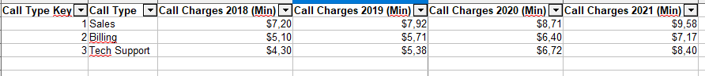
  <figcaption><h6 align="center">Aperçu des données brutes Taxes d&#39;appel</h6></figcaption>
  

</figure>
    
<li>Types d&#39;appels (1 onglet source)</li>
  
<figure>

  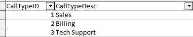
  <figcaption><h6 align="center">Aperçu des données brutes Types d&#39;appel</h6></figcaption>
  

</figure>
    
<li>Employés (64 entrées, 1 onglet source)</li>
  
<figure>

  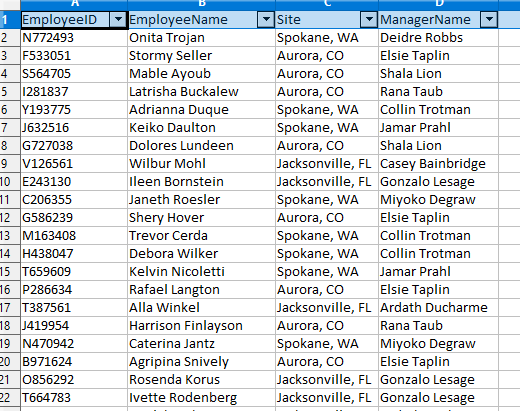
  <figcaption><h6 align="center">Aperçu des données brutes Employés</h6></figcaption>
  

</figure>
    

</ul>

<!--

qu&#39;il faut :

<ul>
<li>identifier</li>
<li>formater</li>
<li>contrôler</li>
<li>organiser dans un modèle de données </li>
<li>faire fonctionner</li>
<li>documenter</li>
<li>maintenir</li>
</ul>

Source - https://stackoverflow.com/a
Posted by bim, modified by community. See post 'Timeline' for change history
Retrieved 2025-12-19, License - CC BY-SA 4.0

<figure>

  
  <figcaption><h6 align="center">Version de travail du modèle de données</h6></figcaption>
  

</figure>

-->

<button class="accordion">📊Axes d'analyse et principaux KPI mis en place</button>

<h4 id="liste"></h4>
<ul>
<li>Vision globale du service client et évolution sur la période étudiée (2018-2021)
   &#9654 Scores SLA, volumes et durées d'appels selon les types d'appels et les bureaux de traitement</li>  
<li>Analyse des revenus 
   &#9654 Valeurs, moyennes et progressions par bureau, par type d'appel, par manager</li>  
<li>Analyse des performances managers et équipes 
   &#9654 Nombre d'appels reçus, décrochés, durées d'appel et d'attente moyennes, score SLA par ville, manager, employé</li>  
</ul>
 

<button class="accordion">:hammer_and_wrench: Traitement des données</button>

<h4 id="liste-traitements-init">Traitements et ajouts initiaux</h4>
<ul>
<li>Import dans Power Query</li>
<li>Gestion des formats (Dates, Décimaux)</li>
<li>Merge des fichiers de données Appels des 4 années</li>
<li>Création colonnes State et City (séparation depuis la colonne Site qui est ensuite supprimée</li>
<li>Création colonne SLA Compliance (booléen, conditionnel)</li>
<li>Création colonne Call Revenue (selon type d'appel et année)</li>
</ul>
<h4 id="liste-traitements-modele">Modèlisation</h4>
<figure>

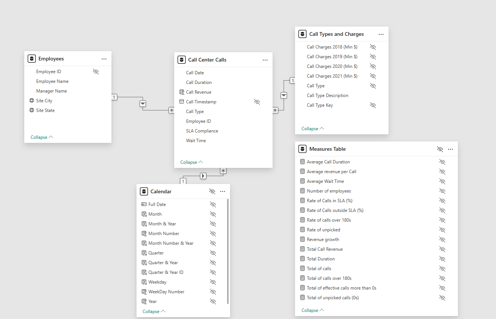
<figcaption><h6 align="center">Modèle en étoile</h6></figcaption>

</figure>
<ul>
<li>Table des faits : appels (Call center Calls)</li>
<li>Tables de dimensions : employés (Employees), types et taxes d'appels (Call Types and Charges)</li>
<li>Table Calendrier (Calendar)</li>
<li>Table des mesures (mesures DAX)- Mesure table</li>
<figure>

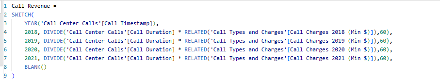
<figcaption><h6 align="center">Exemple mesure DAX Call Revenue</h6></figcaption>

</figure>
</ul>

 

<button class="accordion">:dart: Rapports et principaux insights</button>

 
<h4 id="liste-traitements-modele">Vision globale du service</h4>

<ul>
<li>Période globale
<figure>

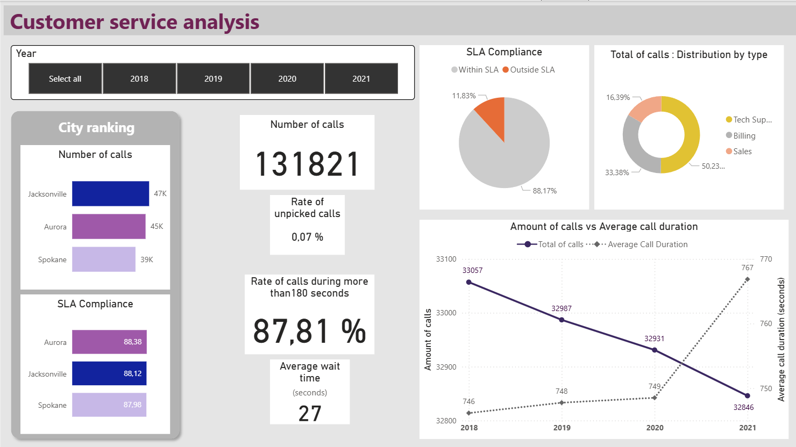
<figcaption><h6 align="center">Aperçu du rapport</h6></figcaption>

</figure>
  <ul>
  <li>Jacksonville est en tête du classement en nombre d'appels (47k) mais le taux de qualité est légèrement meilleur à Aurora sur l'ensemble de la période (88,38% dans le SLA, légèment supérieur à la moyenne globale de 88,17%)</li>
  <li>Les appels au support technique représentent au global environ la moitié du volume d'appels</li>
  <li>Entre 2020 et 2021, la durée moyenne des appels a augmenté (de 746s en 2018 à 767s en 2021) mais leur nombre a diminué (de 33 057 à 32 846).</li>
  <li>Le taux d'appels non décrochés est très faible (0,07%) pour un temps d'attente moyen de 27s.</li>
  <li>Plus de 87% des appels durent plus de 3min.</li>
  </ul>
</li>
<li>Exemple de filtre : En 2020 pour la ville d'Aurora
<figure>

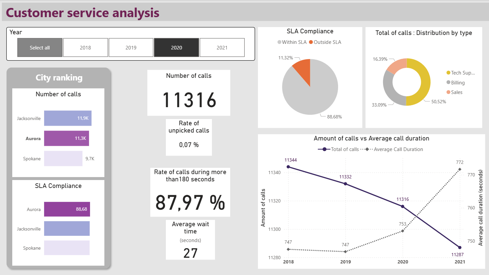
<figcaption><h6 align="center">Aperçu du rapport filtré</h6></figcaption>

</figure>
</li>
</ul>
 
<h4 id="liste-traitements-modele">Analyse des revenus générés</h4>

<ul>
<li>Toutes villes ensembles
<figure>

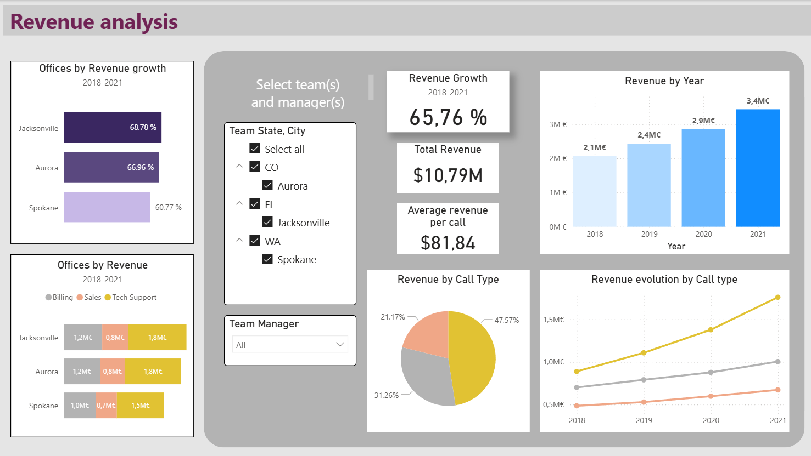
<figcaption><h6 align="center">Aperçu du rapport</h6></figcaption>

</figure>
  <ul>
  <li>xxx</li>
  <li>xxx</li>
  <li>xxx</li>
  <li>xxx</li>
  <li>xxx</li>
  </ul>
</li>
<li>Exemple de filtre : En 2020 pour Jacksonville et le manager Ducharme
<figure>

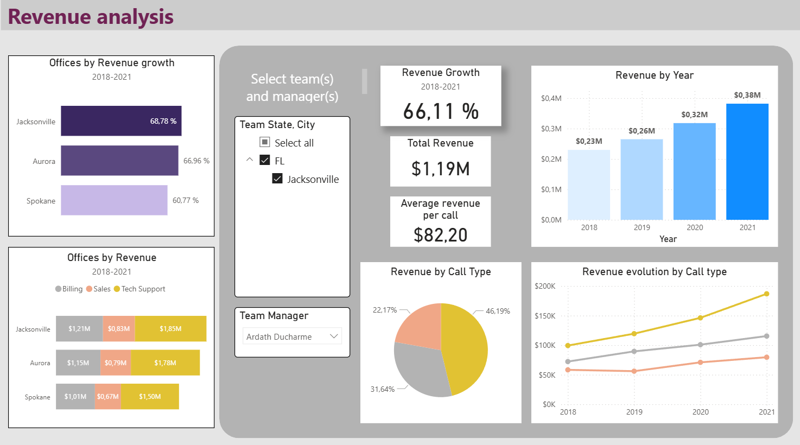
<figcaption><h6 align="center">Aperçu du rapport filtré</h6></figcaption>

</figure>
</li>
</ul>
 
<h4 id="liste-traitements-modele">Analyse des performances managers et équipes</h4>

<ul>
<li>Toutes villes ensembles
<figure>

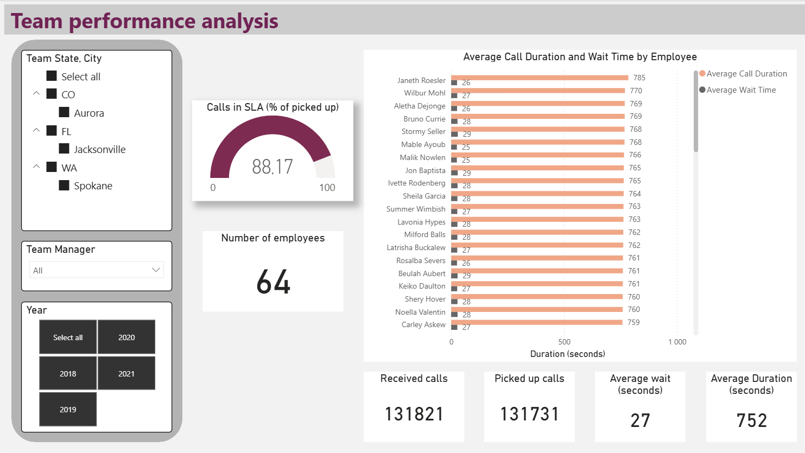
<figcaption><h6 align="center">Aperçu du rapport</h6></figcaption>

</figure>
  <ul>
  <li>xxx</li>
  <li>xxx</li>
  <li>xxx</li>
  <li>xxx</li>
  <li>xxx</li>
  </ul>
</li>
<li>Exemple de filtre : En 2021 pour Jacksonville et le manager Ducharme
<figure>

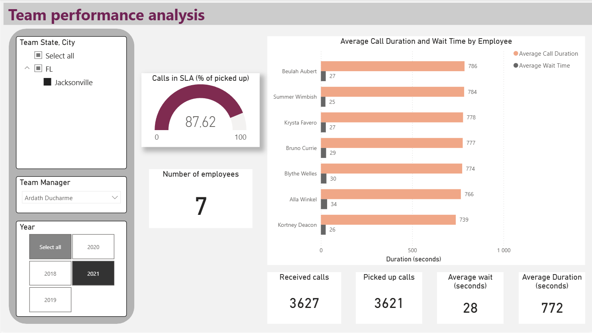
<figcaption><h6 align="center">Aperçu du rapport filtré</h6></figcaption>

</figure>
</li>
</ul>

