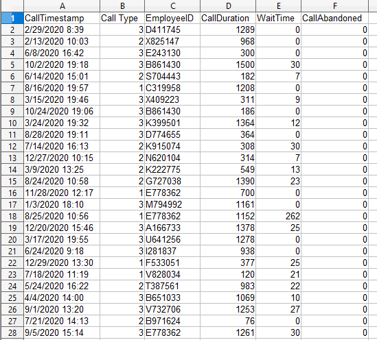
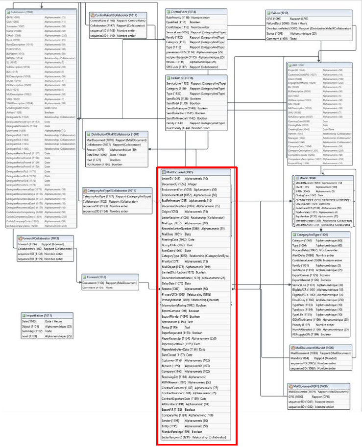
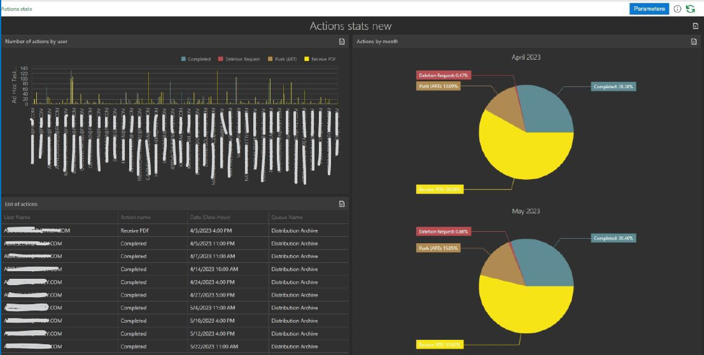
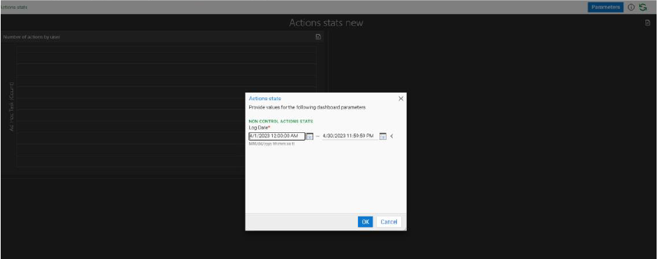
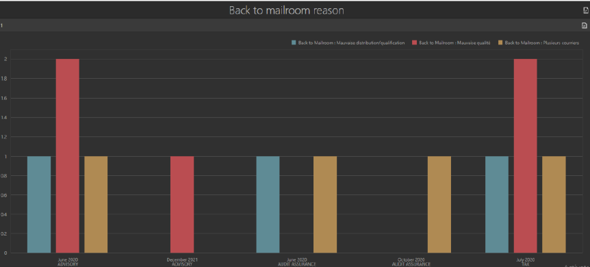

# Tableaux de bord :   Activités, revenus et performance des équipes d'un service de centre d'appels

  Projet individuel académique

## Contexte 
Mettre en place un tableau de bord pour une entreprise qui propose des services externalisés de centre d'appels (facturation aux clients de services d'appel qui comprennent l'assistance technique, la facturation et les ventes).

### Axes d'analyses
<ul>
<li>Vision globale du service client et évolution sur la priode étudiée (2018-2021)</li>
<li>Analyse des revenus</li>
<li>Analyse des performances managers et équipes</li>
</ul>

<!--
:incoming_envelope: &#9654; scan :page_facing_up: &#9654; import :open_file_folder: &#9654; indexation :desktop_computer: &#9654; traitement business :briefcase: &#9654; export pour archivage :file_cabinet:
-->

### Stack
csv -xlsx  
Power Query-Power BI  

<button class="accordion">🔍Les données</button>

   

(données réelles anonymisées)

<ul>
<li>Appels (131 821 entrées au total, 7 variables- 4 fichiers sources)</li>
<figure>

  
  <figcaption><h6 align="center">Aperçu des données brutes Appels</h6></figcaption>
  

</figure>
  
<li>Taxes d'appel (selon l'année - 1 fichier source)</li>

<li>Types d'appels (1 onglet source)</li>

<li>Employés (64 entrées, 1 onglet source)</li>

</ul>

qu&#39;il faut :

<ul>
<li>identifier</li>
<li>formater</li>
<li>contrôler</li>
<li>organiser dans un modèle de données </li>
<li>faire fonctionner</li>
<li>documenter</li>
<li>maintenir</li>
</ul>

<!--
Source - https://stackoverflow.com/a
Posted by bim, modified by community. See post 'Timeline' for change history
Retrieved 2025-12-19, License - CC BY-SA 4.0
-->

<figure>

  
  <figcaption><h6 align="center">Version de travail du modèle de données</h6></figcaption>
  

</figure>

<button class="accordion">📊Focus besoin de monitoring</button>

 

Au sein de la solution même,

<ul>
<li>
Mettre à disposition le monitoring de la solution, du point de vue de l&#39;éxécution automatique (imports de documents, workflows de traitements, exports)
mais aussi des actions utlisateurs au sein des workflows fontionnels.

</li>
<li>
Monitorer la mise à jour automatisée quotidienne des données utiles issues de 3 référentiels client

</li>
<li>
Notifier les erreurs aux administrateurs pour action corrective 

</li>
</ul>

<button class="accordion">:hammer_and_wrench: Actions mises en place</button>

<h4 id="monitoring-de-la-solution">Monitoring de la solution</h4>
<ul>
<li>Utilisation du module Reporting Dashboards du progiciel utilisé OnBase (Hyland)</li>
<li>Accès via client lourd ou via le client web directement par URL, déjà exploités par les utilisateurs métier pour les workflows fonctionnels comme services et techniques pour les worflows de traitement.</li>
<li>Droits d&#39;accès aux dashboards selon les groupes utilisateurs et rôles associés</li>
</ul>
<h4 id="monitoring-de-la-mise-jour-automatis-e-quotidienne-des-donn-es-utiles-issues-de-3-r-f-rentiels-client">Monitoring de la mise à jour automatisée quotidienne des données utiles issues de 3 référentiels client</h4>
<ul>
<li>Logs spécifiques créés directement via le script d&#39;import en C#.</li>
<li>Ces logs sont ensuite exploités comme des objets de la solution et consultables dans une vue dédiée aux administrateurs.</li>
</ul>
<h4 id="notifications">Notifications</h4>
<ul>
<li>Selon la nature de l&#39;erreur et sa source, un email de notification est envoyé en temps réel avec toutes les informations de tracking et la description de l&#39;erreur au groupe d&#39;utiliateurs administrateurs concernés</li>
</ul>
 
<h4 id="liste-des-rapports-dynamiques-mis-en-place">Liste des rapports dynamiques mis en place</h4>
 
<ul>
<li>
<strong>Actions stats</strong> :
Statistiques par action utilisateur une fois le document validé (e.g. : Paper version request, PDF export, etc.), par utilisateur et groupe d&#39;utilisateurs

<figure>

<figcaption><h6 align="center">Exemple reporting web &#39;Action stats&#39;</h6></figcaption>

</figure>
<figure>

<figcaption><h6 align="center">Exemple date picker web &#39;Action stats&#39;</h6></figcaption>

</figure>
</li>
<li>
<strong>Control stats</strong> :
Statistiques par action utilisateur en phase de contrôle du document (Qualify and Send, or Forward back to mailroom, and reason for forwarding back), by user and user group
Détail raisons de refus/renvoi du document après numérisation

<figure>

<figcaption><h6 align="center">Exemple Nombre de renvois par motif de refus</h6></figcaption>

</figure></li>
<li><strong>Import stats - month details</strong> : 
Imports de documents par Service et par mois (importés via scanners tiers)</li>
<li><strong>Indexing stats - month details</strong> : 
Indexation des documents par service, par mois et temps moyen d&#39;indexation</li>
<li><strong>Mailroom global stats - day</strong> : 
Documents importés et indexés par batch et par jour (enveloppes exclues)</li>
<li><strong>Mailroom global stats - month</strong> : 
Documents importés et indexés par batch et par mois (enveloppes exclues)</li>
<li><strong>User activity</strong> :
Connexions par utilisateur et groupe d&#39;utilisateurs par jour</li>
<li><strong>Disk Group report</strong> : 
Espace disque utilisé par chaque service/type sur le serveur de fichiers (NAS).</li>
<li><strong>TAX-PAS push AR auto</strong> : 
Nombre et ID des documents AR exportés automatiquement en PDF </li>
<li><strong>PDF auto Email stats</strong> : 
Nombre et statut des emails en envoi automatique avec PDF attaché (seulement pour les services éligibles)</li>
<li><strong>License usage monitoring</strong> : 
License pic usage monitoring- par année, mois, jour, utilisateurs uniques</li>
</ul>

<button class="accordion">:dart: Exemples d'améliorations identifiées grâce à ces rapports, et de résolutions d'incidents auxquelles ils ont contribué</button>

 
<ul>
<li>Ajustement de la résolution des scanners pour équilibrer volumes de fichiers et confort d&#39;exploitation du document numérisé par l&#39;utilisateur</li>
<li>Ajustement des volumes de licences et prévisions d&#39;accroissement au fil du déploiement</li>
<li>Identification, analyse et résolution d&#39;une sauvergarde tierce de DB qui interrompait certains jobs</li>
<li>
Réactivité et reprise en cas d&#39;incident réseau quand les envois auto d&#39;emails ou les dépôts de pdf par la solution étaient affectés

Etc. etc.

</li>
</ul>

