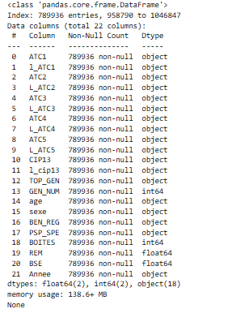
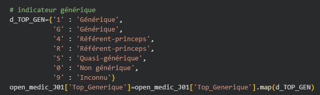
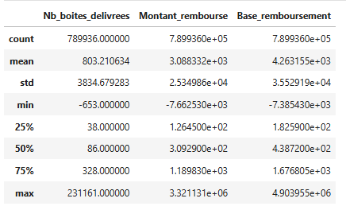
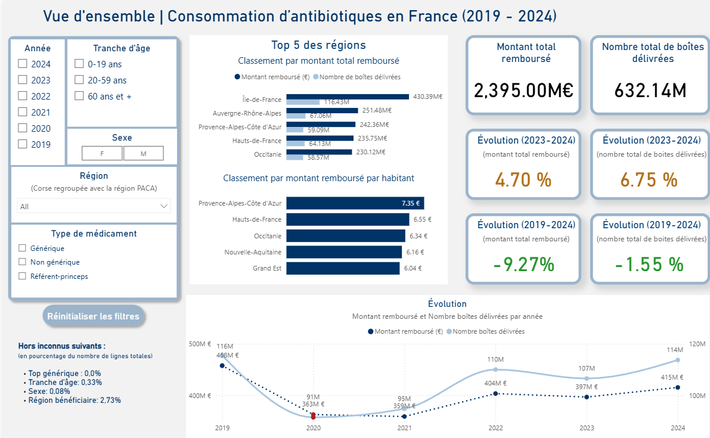
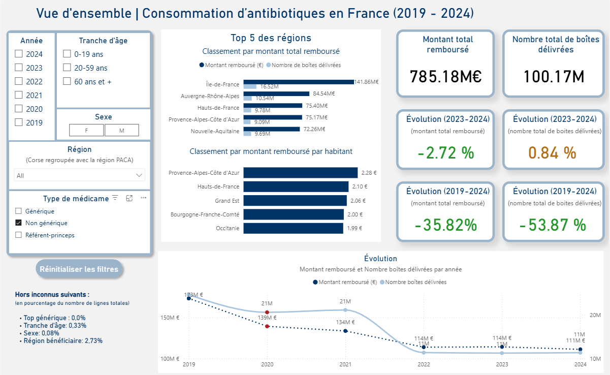
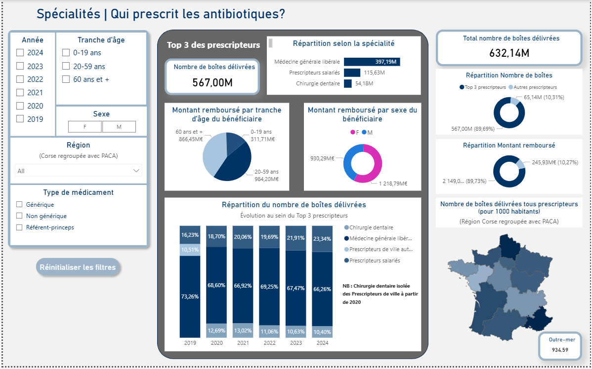
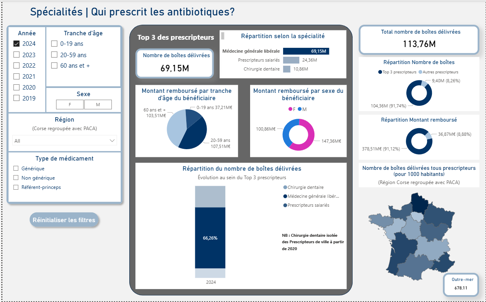
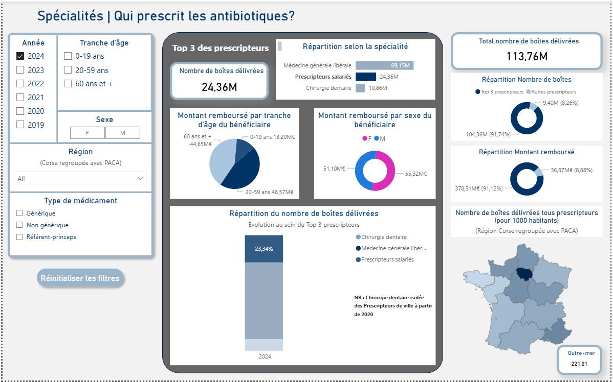
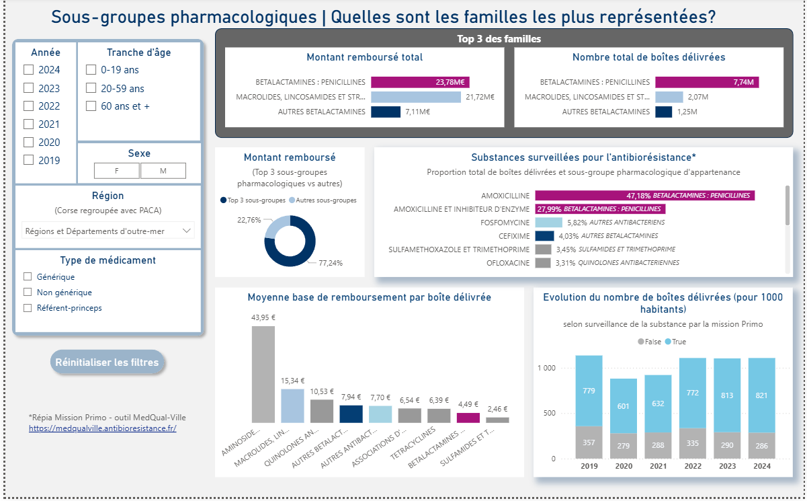
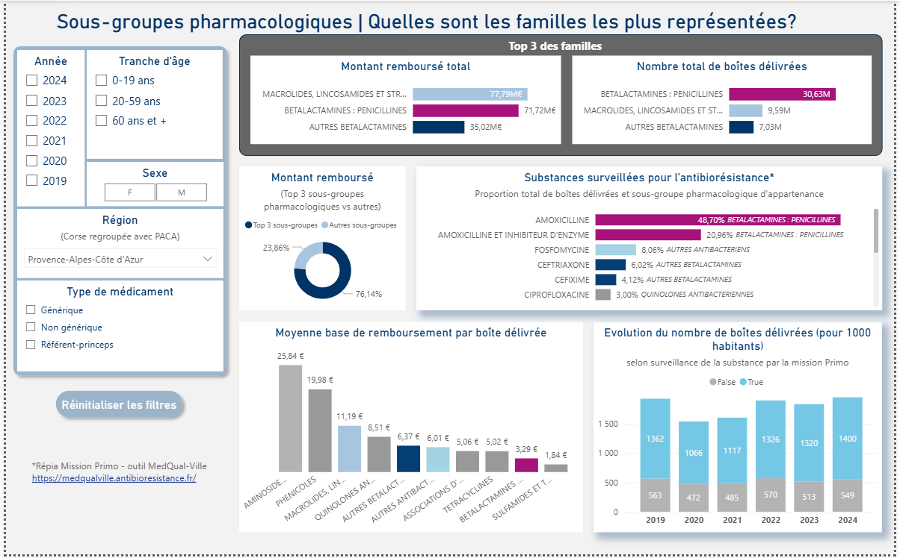

# Analyse ad-hoc :   Consommation des antibiotiques en France 2019-2024

  

  (Projet de groupe retravaillé)

## Contexte 
_« L’utilisation répétée et inadaptée des antibiotiques a favorisé l’apparition de bactéries résistantes à ces
médicaments. Résultat : certaines infections deviennent de plus en plus difficiles à soigner. »_ 
 <a href="https://www.sante.fr/antibiomalin-pour-savoir-comment-bien-utiliser-les-antibiotiques/lantibioresistance" target="_blank" rel="noopener noreferrer">Source</a>

Ainsi la surveillance et la compréhension de la prescription et et délivrance des antibiotiques en France est un des moyens de contribuer à des actions de prévention et d' appuyer les politiques de santé publique sur l'usage raisonné des antibiotiques.

<figure>

  
  <figcaption><h6 align="center">Antibiotiques et antibiorésistance</h6></figcaption>
  

</figure>

<a href="https://sante.gouv.fr/IMG/pdf/strategie_nationale_2022-2025_prevention_des_infections_et_de_l_antibioresistance.pdf" target="_blank" rel="noopener noreferrer">(Source image)</a>
 

N&#39;hésitez pas à consulter <a href="project_FR_2_glossaire.html" target="_blank" rel="noopener noreferrer">le glossaire</a>.

### Stack
Python, PowerBI

 

<button class="accordion">:pill: Problématique</button>

  

En étudiant les données de remboursement (montants remboursés, nombre de boîtes délivrées) selon les axes prescripteur, bénéficiaire, sous-groupe pharmacologique, on cherche à répondre aux questions suivantes : 

<ul>
<li>Quelles sont les tendances de consommation sur la période étudiée selon les caractéristiques démographiques, territoriales et les familles d'antibiotiques ?</li>
<li>Quels critères ou territoires présentent des dynamiques de consommation atypiques ou remarquables ?</li>
<li>Quelles interactions existent entre les différents facteurs analysés ?</li>
<li>Quelle est la part des substances surveillées pour l’antibiorésistance parmi l’ensemble des antibiotiques délivrés en ville ?</li>
</ul>

  
Note

 
  &quot;<em>Ces données de remboursement [données SNDS] sont utilisées comme proxy de la consommation française, faisant l’hypothèse d’une part que toutes les prescriptions donnent lieu à remboursement, et d’autre part que l’ensemble des médicaments remboursés par l’Assurance maladie ont été consommés par les patients concernés.</em>&quot; <a href="https://www.santepubliquefrance.fr/maladies-et-traumatismes/infections-associees-aux-soins-et-resistance-aux-antibiotiques/resistance-aux-antibiotiques/documents/rapport-synthese/la-consommation-d-antibiotiques-en-secteur-de-ville-en-france-2009-2019.-synthese-preliminaire-des-indicateurs-disponibles-sous-geodes">Synthèse préliminaire des indicateurs disponibles sous Géodes (11-2020)</a>

&#9654; Pour une approche alignée en unités avec les objectifs posés dans la <a href="https://sante.gouv.fr/IMG/pdf/strategie_nationale_2022-2025_prevention_des_infections_et_de_l_antibioresistance.pdf">stratégie nationale 2022-2025 de prévention des infections et de l&#39;antibioresistance</a>, exprimés en doses définies journalières (DDJ) pour 1 000 habitants et par jour et en prescriptions pour 1 000 habitants et par an, voir le <a href="https://www.santepubliquefrance.fr/maladies-et-traumatismes/infections-associees-aux-soins-et-resistance-aux-antibiotiques/resistance-aux-antibiotiques/documents/rapport-synthese/consommation-d-antibiotiques-en-secteur-de-ville-en-france-2014-2024">Rapport de Santé publique France (11-2025)</a>.

&#9654; La notion de proxy implique que les principales tendances sont perceptibles dès une première analyse des données de remboursement, même si ces données ne suffisent pas à elles seules pour mener une analyse approfondie et exhaustive.

&#9654;  Compte tenu des contraintes de temps du projet, <strong>l&#39;étude concerne uniquement l'analyse des données de remboursement Open Medic</strong>, visant à <strong>identifier les tendances majeures</strong> et à <strong>proposer des indicateurs complémentaires</strong> aux DDJ et aux prescriptions, en particulier sur la <strong>nature</strong> et le <strong>prix des médicaments</strong>.

<button class="accordion">:file_cabinet: Sources de données utilisées</button>

<h4 id="principale">Principale</h4>
<ul>
<li>Base Open Medic (données SNDS) mis à disposition librement par l’État sur la plate-forme <a href="https://www.data.gouv.fr/datasets/open-medic-base-complete-sur-les-depenses-de-medicaments-interregimes" target="_blank" rel="noopener noreferrer">data.gouv.fr</a><ul>
<li>Dépenses de médicaments/remboursements délivrés en pharmacies de ville, selon des groupes d’éléments descriptifs bénéficiaires (tranche d&#39;âge, sexe, région de résidence), spécialité prescripteur, type de médicament, par année.</li>
<li>Structuré selon la classification hiérarchique ATC (Anatomique, Thérapeutique et Chimique) des médicaments</li>
<li>Mise à disposition annuelle</li>
<li>Utilisation de la base principale pour les années 2019 à 2024 : 6 fichiers open_medic_AAAA.csv</li>
<li>Antibiotiques identifiés par le code ATC2 : J01-ANTIBACTERIENS A USAGE SYSTEMIQUE</li>
</ul>
</li>
</ul>
<figure>

  
  <figcaption><h6 align="center">Aperçu des données - Base principale Open Medic</h6></figcaption>
  

</figure>

<h4 id="compl-mentaires-contexte">Complémentaires/Contexte</h4>
<ul>
<li>
Fichier INSEE (Institut national de la statistique et des études économiques)

<ul>
<li>Population par région de France, sexe et grandes classes d&#39;âge (1975-2025) (INSEE via <a href="https://www.ined.fr/fichier/s_rubrique/159/estim.pop.nreg.sexe.gca.1975.2025.fr.xlsx" target="_blank" rel="noopener noreferrer">INED - Institut national des études démographiques</a></li>
</ul>
</li>
<li>
Liste PRIMO 

<ul>
<li>Liste des substances antibiotiques surveillées en France dans le cadre de la <a href="https://medqualville.antibioresistance.fr/resistances/synthese" target="_blank" rel="noopener noreferrer">mission PRIMO</a> sur l&#39;antibiorésistance</li>
</ul>
</li>
</ul>

<button class="accordion">:hammer_and_wrench: Méthodologie - Etapes de traitement des données Open Medic</button>

<ol>
<li>
Analyse des variables et listes de valeurs, définition des formats et listes cibles

</li>
<li>
Chargement initial 

<ul>
<li>Import des 6 fichiers zips csv (Python)</li>
<li>Gestion de l&#39;encodage</li>
<li>Gestion des formats de variables (colonnes)</li>
<li>Ajout et valorisation d&#39;une colonne année</li>
<li>Normalisation des noms de colonnes</li>
<li>Concaténation des 6 fichiers</li>
<li>Contrôle des doublons</li>
<li>Contrôle des volumétries et valeurs manquantes 
  <figure>

<figcaption><h6 align="center">Volumes après concaténation - état initial</h6></figcaption>

</figure>
<figure>

<figcaption><h6 align="center">Valeurs manquantes après concaténation - état initial</h6></figcaption>

</figure>
</li>
</ul>
</li>
<li>Filtrage<ul>
<li>Filtrage du dataframe sur ATC2=&#39;J01&#39; de façon à ne conserver que le périmètre des antibiotiques</li>
<li>Contrôle des volumétries et valeurs manquantes<figure>  

<figcaption><h6 align="center">Volumes et valeurs manquantes après filtrage</h6></figcaption>

</figure>

</li>
</ul>
</li>

<li>
Adaptation des variables

<ul>
<li>Suppression des variables non pertinentes</li>
<li>Renommage plus explicite des variables</li>
<li>Ajout de variables libellés en vue de la gestion des visualisations d&#39;exploration</li>
<li>Transcodage de valeurs catégorielles<ul>
<li>Exemple cas particulier du top générique, dont la codification a changé au cours de la période étudiée<figure> 

<figcaption><h6 align="center">Codage Top Générique issu de la documentation du jeu de données</h6></figcaption>

</figure>
<figure> 

<figcaption><h6 align="center">Codage Top Générique normalisé</h6></figcaption>

</figure>
</li>
</ul>
</li>
</ul>
</li>
<li>
Variable indiquant si la substance est surveillée ou non pour l&#39;antibiorésistance (merge avec la liste mission PRIMO)

<ul>
  <li>Ajout
<figure> 

<figcaption><h6 align="center">Ajout variable liste Primo (merge)</h6></figcaption>

</figure>
  </li>
</ul> 
<ul>
<li>Valorisation des valeurs manquantes liste primo à false, après vérification des lignes concernées<figure> 

<figcaption><h6 align="center">Gestion NA liste Primo</h6></figcaption>

</figure>
</li>
</ul>
</li>
<li>
Gestion des valeurs négatives

<ul>
<li>
Identifiées via la méthode <em>describe (min)</em> et documentées sur la discussion Open Medic (il s&#39;agit de régularisations de remboursements)

<figure> 

<figcaption><h6 align="center">Describe valeurs quantitatives</h6></figcaption>

</figure>
<figure> 

<figcaption><h6 align="center">Traitement montants négatifs</h6></figcaption>

</figure>
<figure> 

<figcaption><h6 align="center">Traitement montants négatifs-résultat</h6></figcaption>

</figure>
</li>
<li>
Supprimées car en proportion très petite et non pertinentes pour les visualisations

</li>
</ul>
</li>
<li>
Vérification des outliers

<ul>
<li>On constate une grande dispersion à droite des données quantitatives : on étudie les outliers et la proportion qu&#39;ils représentent. Ce ne sont pas des valeurs aberrantes; ils doivent être conservés.<figure> 

<figcaption><h6 align="center">Etude des outliers</h6></figcaption>

</figure>
</li>
</ul>
</li>

<li>Gestion des valeurs inconnues
  <ul>
<li>Le jeu de données ne comporte pas de NA mais des valeurs renseignées à &quot;Inconnu&quot;.</li>
<li>Les valeurs inconnues (catégorielles) des différents critères sont introduites pour préserver le secret statistique lors qu&#39;un groupe concerne moins de 10 bénéficiaires.</li>
<li>Le remplacement par le mode par exemple créerait beaucoup d&#39;approximation, notamment lorsqu&#39;une ligne/un groupe présente plusieurs critères inconnus.</li>
<li>Contrôle de la proportion de lignes concernées : on conserve les lignes qui seront filtrées au besoin pour les visualisations</li>
</ul>
</li>
 
<figure> 
  

  
  <figcaption><h6 align="center">Pourcentages des valeurs inconnues</h6></figcaption>
  

</figure>

<li>
Vérification finale des doublons et valeurs manquantes

</li>
<li>
Résultats du traitement

</li>
</ol>
<figure> 
  

  
  <figcaption><h6 align="center">Informations du jeu de données après traitements</h6></figcaption>
  

</figure>   

<button class="accordion">:hammer_and_wrench: Méthodologie - Etapes de traitement des données de contexte</button>

<ul>
<li>Fichier INSEE<ul>
<li>Regroupement chiffres régions PACA et Corse pour aligner sur la répartition Open Medic</li>
<li>Regroupement chiffres tranches d&#39;âge pour aligner sur la répartition Open Medic</li>
<li>Concaténation des 6 onglets (1 par année) en un seul avec ajout de la colonne année</li>
<li>Normalisation des valeurs Régions, sexe et tranche d&#39;âge (iso Open Medic)

<figure> 

<figcaption><h6 align="center">Aperçu des données INSEE brutes (exemple année 2024)</h6></figcaption>

</figure>

</li>
</ul>
</li>
</ul>

    

<figure> 
  

  
  <figcaption><h6 align="center">Aperçu des données INSEE après traitement</h6></figcaption>
  

</figure>   

<ul>
<li>Liste PRIMO<ul>
<li>Récupération des codes ATC5 pour les substances de code ATC3 égal à J01 (antibiotiques)</li>
<li>Valorisation d&#39;un booléen à True si la substance ATC5 est surveillée (voir ci-dessus étape 5 traitement fichier Open Medic)</li>
</ul>
</li>
</ul>

<button class="accordion"> :gear: Modélisation Power BI</button>

 
  <figure> 
  

  
  <figcaption><h6 align="center">Modèle Power BI</h6></figcaption>
  

</figure> 

On met en place un modèle en constellation (2 étoiles aux dimensions communes) :

<ul>
<li>Table des remboursements : Table de faits</li>
<li>Tables de dimension : Age, sexe, région bénéficiare, Prescripteur, Année, Antibiotique</li>
<li>Table Insee : Traitée comme une table de faits pour appliquer les dimensions région, année, age, sexe et exploiter les chiffres de population segmentée.</li>
<li>Table de mesures DAX</li>
</ul>
     

<button class="accordion"> :dart: Principaux résultats et visualisations 📊</button>

 
<h2 id="exploration-pr-alable-python-exemples">Exploration préalable (Python) - exemples</h2>
<ul>
<li>
Le montant remboursé et la base de remboursement ont une relation linéaire (coefficient taux de remboursement).

<figure> 

<figcaption><h6 align="center">Relation linéaire Montant remboursé/Base de remboursement</h6></figcaption>

</figure>  
</li>
<li>
Le montant remboursé (ou la base de remboursement) et le nombre de boîtes délivrées ont une corrélation statistique positive forte mais n&#39;ont pas une relation linéaire. Il est donc intéressant/complémentaire d&#39;observer les comportements de ces 2 variables sur les mêmes critères.

<figure> 

<figcaption><h6 align="center">Matrice de corrélations</h6></figcaption>

</figure> <figure> 

<figcaption><h6 align="center">Relation non linéaire Montant remboursé/Nombre de boîtes délivrées</h6></figcaption>

</figure>  

</li>
</ul>
<h2 id="tendance-globale">Tendance globale</h2>
<ul>
<li>Ce rapport présente les éléments clés et les KPIs généraux qui seront déclinés dans les autres rapports sous les
axes de prescription, remboursement et familles d&#39;antibiotiques.</li>
</ul>
<figure> 
  

  
  <figcaption><h6 align="center">Rapport Vision globale</h6></figcaption>
  

</figure> 

<h4 id="variations">Variations</h4>
<ul>
<li>
L&#39;année 2020, avec le Covid, est marquée par une baisse du nombre de boîtes consommées comme des
montants remboursés. Suit une hausse progressive de 2021 à 2022 puis une légère inflexion en 2023.

</li>
<li>
Si, sur l&#39;ensemble de la période étudiée, la tendance globale est à la baisse pour le nombre de boîtes
consommées comme pour les montants remboursés, la tendance est à la hausse sur ces 2 indicateurs pour la
dernière année.

</li>
</ul>
<blockquote>

La mise en place, en 2022, de la stratégie nationale de prévention des infections et de l&#39;antibiorésistance peut expliquer l&#39;inflexion observée en 2023 ; toutefois, ses effets ne semblent pas se maintenir dans le temps au regard de ces indicateurs.

</blockquote>
<ul>
<li>On remarque que seuls les médicaments non-génériques affichent une réelle baisse sur 2019-2024 avec une nette baisse
entre 2021 et 2022 et une tendance plutôt stable sur 2023-2024.</li>
</ul>
<blockquote>

Les nouvelles règles relatives au remboursement des médicaments non-génériques (indexation sur le prix du générique équivalent, souvent inférieur, sauf si non substituable) entrées en vigueur au 01/01/2021 semblent se traduire par une baisse de consommation des antibiotiques non-génériques.

</blockquote>
<figure> 
  

  
  <figcaption><h6 align="center">Rapport Vision globale</h6></figcaption>
  

</figure> 

<h4 id="disparit-s-r-gionales">Disparités régionales</h4>
<ul>
<li>Si l&#39;Île-de-France est en tête des montants remboursés en valeur sur la période étudiée, ce sont globalement les regions PACA-Corse qui remboursent le plus (montant pour 1000 habitants).</li>
</ul>
<h2 id="prescripteurs">Prescripteurs</h2>
<ul>
<li>Ce rapport aborde les indicateurs selon l&#39;axe de la prescription et met en évidence :<ul>
<li>La dominance, tant sur le nombre de boîtes délivrées que sur les montants remboursés, de 3 types de prescripteurs avec largement en tête les médecins généralistes libéraux.</li>
<li>Des diparités régionales et par tranche d&#39;âge</li>
</ul>
</li>
</ul>
<figure> 
  

  
  <figcaption><h6 align="center">Rapport Prescripteurs</h6></figcaption>
  

</figure> 

<h4 id="type-de-prescripteur-et-r-partition-des-montants">Type de prescripteur et répartition des montants</h4>
<ul>
<li>
Le top 3 des prescripteurs représente plus de 90% des prescriptions, en montant remboursé comme en nombre
de boîtes délivrées.

</li>
<li>
Au sein de ce top 3, les médecins généralistes libéraux dominent largement, quels que soient le critère, la région
ou l&#39;année. De même le 2ème rang est toujours occupé par les prescripteurs salariés (établissements de santé/hôpitaux) et le 3ème par la chirurgie dentaire (1 exception cependant pour les 0-19 ans avec la Pédiatrie libérale en 3ème position).

</li>
</ul>
<figure> 
  

  
  <figcaption><h6 align="center">Détail Prescripteurs 0-19 ans</h6></figcaption>
  

</figure> 

<h4 id="disparit-s-r-gionales">Disparités régionales</h4>
<ul>
<li>On observe que la répartition sur le territoire en nombre de boîtes pour 1000 habitants varie fortement selon la spécialité du prescripteur, notamment ceux du top 3.</li>
</ul>
<figure> 
  

  
  <figcaption><h6 align="center">Rapport Prescripteurs - détail médecine générale 2024</h6></figcaption>
  

</figure> 
<figure> 
  

  
  <figcaption><h6 align="center">Rapport Prescripteurs - détail Prescripteurs salariés 2024</h6></figcaption>
  

</figure> 
<figure> 
  

  
  <figcaption><h6 align="center">Rapport Prescripteurs - détail Chirurgiens dentistes 2024</h6></figcaption>
  

</figure> 

<h2 id="remboursements-et-prix-des-antibiotiques">Remboursements et prix des antibiotiques</h2>
<ul>
<li>Ce rapport aborde l&#39;axe de la charge financière représentée par les remboursements.
Il introduit la notion de prix du médicament avec l&#39;indicateur du <em>Montant moyen remboursé par boîte </em> et la <em>aleur moyenne par type de médicament de la base de remboursement</em>v.</li>
</ul>
<figure> 
  

  
  <figcaption><h6 align="center">Rapport Remboursements</h6></figcaption>
  

</figure> 

<h4 id="impact-du-type-de-m-dicament">Impact du type de médicament</h4>
<ul>
<li>
La base de remboursement est toujours plus élevée pour les non-génériques et référents que pour les génériques, comme le montant remboursé moyen (valable sur toute la période comme sur la dernière année 2024).

</li>
<li>
La part des médicaments génériques, moins chers, dans les montants remboursés a augmenté sur la période étudiée dans
son ensemble ainsi que sur la dernière année :

<ul>
<li>Part génériques 2019 : 56,49%</li>
<li>Part génériques 2023 : 65,51%</li>
<li>Part génériques 2024 : 67,2%</li>
</ul>
</li>
</ul>
<h4 id="disparit-s-r-gionales">Disparités régionales</h4>
<ul>
<li>Les régions PACA-Corse et d&#39;Outre-mer ont les montants moyens remboursés par boîte les plus élevés, avec cependant une tendance à la baisse (tous types de médicaments confondus) . La région Centre-Val de Loire a le montant le plus bas.</li>
</ul>
<blockquote>

Pour les non-génériques seuls, la tendance est à la hausse sur cet indicateur.

</blockquote>
<figure> 
  

  
  <figcaption><h6 align="center">Rapport Remboursements non génériques 2024</h6></figcaption>
  

</figure> 

<ul>
<li>Les régions PACA-Corse et Hauts-de-France sont celles où le montant remboursé par habitant est le plus élevé. A l&#39;opposé on trouve les régions Auvergne-Rhône-Alpes et Centre-Val de loire.</li>
</ul>
<h4 id="r-partition-prescripteurs">Répartition prescripteurs</h4>
<ul>
<li>On observe une répartition similaire à celle du nombre de boîtes pour le top 3 prescripteurs, avec le même type d&#39;évolution :<ul>
<li>Dominance de la médecine générale libérale sur les prescripteurs salariés et les chirurgiens dentistes (pédiatrie libérale pour les 0-19 ans)</li>
<li>Progression dans le temps de la part des prescripteurs salariés dans le top 3</li>
</ul>
</li>
</ul>

NB : Les Prescripteurs de ville en 2019 incluent les dentistes, qui en sont isolés à partir de 2020. Leur part est donc relativement stable.

<h3 id="sexe-b-n-ficiaire">Sexe bénéficiaire</h3>
<ul>
<li>Les montants remboursés sont globalement plus élévés par habitant pour le sexe féminin mais de façon plus équilibrée sur les 0-19 ans.</li>
</ul>
<figure> 
  

  
  <figcaption><h6 align="center">Rapport Remboursements 0-19 ans 2024</h6></figcaption>
  

</figure> 

<h2 id="familles-consomm-es-et-part-des-substances-surveill-es">Familles consommées et part des substances surveillées</h2>
<ul>
<li>Ce rapport aborde les indicateurs selon l&#39;axe des sous-groupes pharmacologiques (famille d&#39;antibiotiques).</li>
</ul>
<figure> 
  

  
  <figcaption><h6 align="center">Rapport Sous-groupes pharmacologiques</h6></figcaption>
  

</figure> 

<h4 id="familles-dominantes">Familles dominantes</h4>
<ul>
<li>Le top 3 est dominé tous critères confondus par les Bêtalactamines-Pénicillines, Macrolides et Autres
bêtalactamines ( ex : céphalosporines), en nombre de boîtes comme en montant remboursé.</li>
<li>L&#39;ordre entre les 2 premières familles varie selon les critères ci-après mais la 3ème place ne change pas.</li>
</ul>
<h4 id="impact-de-la-tanche-d-ge-du-b-n-ficiaire">Impact de la tanche d&#39;âge du bénéficiaire</h4>
<ul>
<li>
Pour la tranche d&#39;âge des 60 ans et +, la famille des macrolides devance les bêtalactamines en montant
remboursé. (thérapies plus ciblées)

</li>
<li>
Pour la tranche d&#39;âge des 0-19 ans, le top 3 des familles atteint plus de 80% des montants remboursés pour 75 à
76% sur les autres tranches d&#39;âge.

</li>
</ul>
<figure> 
  

  
  <figcaption><h6 align="center">Rapport Sous-groupes pharmacologiques - 0-19 ans - 2024</h6></figcaption>
  

</figure> 

<h4 id="sp-cificit-s-r-gionales">Spécificités régionales</h4>
<ul>
<li>Pour les régions PACA-Corse et Grand-Est, la famille des macrolides est en tête du top 3 au global en montant
remboursé (toujours 2ème pour le nombre de boites délivrées), pas seulement pour les plus de 60 ans.</li>
</ul>
<figure> 
  

  
  <figcaption><h6 align="center">Rapport Sous-groupes pharmacologiques - PACA-Corse</h6></figcaption>
  

</figure> 

<h4 id="impact-du-type-de-m-dicament-et-prix-moyen-par-famille">Impact du type de médicament et prix moyen par famille</h4>
<ul>
<li>La base de remboursement moyenne par boîte est toujours plus élevée (environ x3,5) pour la famille des
macrolides que pour la famille des bêtalactamines-pénicillines.</li>
</ul>
<blockquote>

C&#39;est un facteur d&#39;explication du fait que l&#39;écart en montant des remboursements entre les bêtalactaminespénicillines
et macrolides est beaucoup moins grand que l&#39;écart en nombre de boîtes délivrées pour les 2
familles (visibles sur les barres de top 3).

</blockquote>
<h4 id="substances-surveill-es-pour-l-antibior-sistance">Substances surveillées pour l&#39;antibiorésistance</h4>
<ul>
<li>
L&#39;amoxicilline représente environ <strong>75%</strong> des boîtes délivrées sur l&#39;ensemble de la période (proportion équivalente pour 2024), atteignant plus de <strong>90%</strong> pour les 0-19 ans en 2024.

</li>
<li>
Les substances surveillées sont majoritaires (en nombre de boîtes délivrées).

</li>
</ul>

